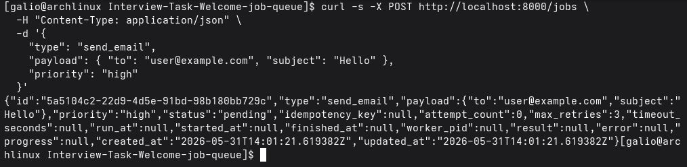
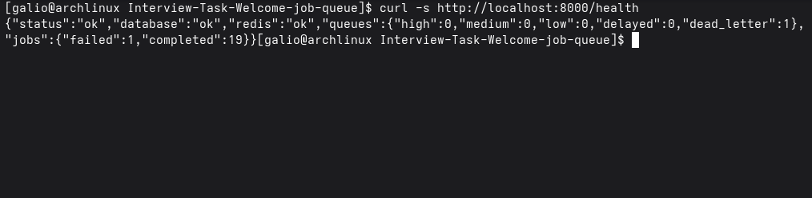

# Job Queue System

A distributed job queue built with FastAPI, Redis, and PostgreSQL. Supports priority-based scheduling, delayed execution, retries with exponential backoff, and structured JSON logging.

---

## How to Run

**Prerequisites:** Docker and Docker Compose.

```bash
docker compose up --build
```

This starts four services:
- `postgres` — PostgreSQL 16 on the default port (internal only)
- `redis` — Redis 7 on the default port (internal only)
- `api` — FastAPI on `http://localhost:8000`
- `worker` — 2 worker processes + a scheduler process

The API waits for both Postgres and Redis to pass healthchecks before starting. Tables are created automatically on first boot.

To scale workers:

```bash
docker compose up --build --scale worker=3
```

---

## How to Run Tests

```bash
python -m venv venv
source venv/bin/activate
pip install -r requirements.txt -r requirements-dev.txt
pytest
```

To run a specific test file:

```bash
pytest tests/test_retry.py -v
```

---

## How to Submit a Job

### Submit an immediate job

**Request:**
```bash
curl -s -X POST http://localhost:8000/jobs \
  -H "Content-Type: application/json" \
  -d '{
    "type": "send_email",
    "payload": { "to": "user@example.com", "subject": "Hello" },
    "priority": "high"
  }'
```

**Response (`201 Created`):**
```json
{
  "id": "3fa85f64-5717-4562-b3fc-2c963f66afa6",
  "type": "send_email",
  "payload": { "to": "user@example.com", "subject": "Hello" },
  "priority": "high",
  "status": "pending",
  "idempotency_key": null,
  "attempt_count": 0,
  "max_retries": 3,
  "timeout_seconds": null,
  "run_at": null,
  "started_at": null,
  "finished_at": null,
  "worker_pid": null,
  "result": null,
  "error": null,
  "progress": null,
  "created_at": "2026-05-31T12:00:00.000Z",
  "updated_at": "2026-05-31T12:00:00.000Z"
}
```



### Submit a scheduled (delayed) job

```bash
curl -s -X POST http://localhost:8000/jobs \
  -H "Content-Type: application/json" \
  -d '{
    "type": "send_email",
    "payload": { "to": "user@example.com", "subject": "Reminder" },
    "priority": "medium",
    "run_at": "2026-06-01T09:00:00Z"
  }'
```

### Submit with idempotency key (safe to retry)

```bash
curl -s -X POST http://localhost:8000/jobs \
  -H "Content-Type: application/json" \
  -d '{
    "type": "send_email",
    "payload": { "to": "user@example.com", "subject": "Welcome" },
    "idempotency_key": "welcome-email-user-42"
  }'
```

A second request with the same `type` + `idempotency_key` returns the existing job (`200 OK`) instead of creating a duplicate.

### Poll job status

```bash
curl -s http://localhost:8000/jobs/<job-id>
```

### List jobs

```bash
# All jobs
curl -s http://localhost:8000/jobs

# Filter by status
curl -s "http://localhost:8000/jobs?job_status=failed"

# Filter by priority
curl -s "http://localhost:8000/jobs?priority=high"
```

### Cancel a job

```bash
curl -s -X DELETE http://localhost:8000/jobs/<job-id>
```

Returns `204` on success, `409` if the job is already running or in a terminal state.

### Manually retry a failed job

```bash
curl -s -X POST http://localhost:8000/jobs/<job-id>/retry
```

### Health check

```bash
curl -s http://localhost:8000/health
```

```json
{
  "status": "ok",
  "database": "ok",
  "redis": "ok",
  "queues": { "high": 0, "medium": 1, "low": 0, "delayed": 2, "dead_letter": 0 },
  "jobs": { "queued": 1, "running": 0, "failed": 0, "done": 5 }
}
```



---

## Architecture Overview

```
REST Client
    │ HTTP
    ▼
FastAPI (api/) :8000
    │  persist job → PostgreSQL
    │  LPUSH / ZADD → Redis
    ▼
Redis
    ├── queue:high         (List)
    ├── queue:medium       (List)
    ├── queue:low          (List)
    ├── queue:delayed      (Sorted Set, score = run_at timestamp)
    ├── queue:aging:medium (Sorted Set, score = enqueue timestamp)
    ├── queue:aging:low    (Sorted Set, score = enqueue timestamp)
    ├── queue:dead_letter  (Sorted Set)
    └── processing:assignments (Hash, job_id → worker_pid + priority)
    │
    ├── BRPOP ──▶ Worker Process × N  (worker/process.py)
    │                │  claim assignment  (HSET processing:assignments)
    │                │  check cancelled → skip if so
    │                │  execute handler with timeout fence
    │                │  write result → PostgreSQL
    │                │  release assignment (HDEL processing:assignments)
    │                └── on failure: ZADD queue:delayed (retry backoff)
    │                               or ZADD queue:dead_letter (exhausted)
    │
    └── Scheduler Process  (worker/scheduler.py)
         ├── promote loop  (every second)
         │     ZRANGEBYSCORE queue:delayed 0 now
         │     → LPUSH queue:{priority} + ZADD aging set
         │
         ├── elevation loop  (every second)
         │     ZRANGEBYSCORE queue:aging:low  0 now-low_threshold
         │     → LREM queue:low  + LPUSH queue:medium
         │     ZRANGEBYSCORE queue:aging:medium  0 now-medium_threshold
         │     → LREM queue:medium + LPUSH queue:high
         │
         └── liveness loop  (periodic)
               HGETALL processing:assignments
               → for each entry: check worker PID alive
               → if dead: HDEL + LPUSH back to queue (atomic Lua)
                          reset job status → pending in PostgreSQL
```

**Components:**

| Component | Location | Responsibility |
|-----------|----------|----------------|
| API | `api/` | HTTP endpoints, idempotency, job persistence |
| Queue layer | `rqueue/` | Redis enqueue (LPUSH/ZADD) and dequeue (BRPOP) |
| Worker pool | `worker/pool.py` | Spawns N workers + scheduler, crash recovery, graceful shutdown |
| Worker loop | `worker/process.py` | BRPOP → check cancelled → execute → update DB |
| Executor | `worker/executor.py` | Timeout fence, exponential backoff retries, dead-letter queue |
| Scheduler | `worker/scheduler.py` | Atomic Lua script to promote delayed jobs every second; detects orphaned jobs whose worker PID is no longer alive and re-queues them |
| Job registry | `jobs/` | `@register` decorator maps type strings to handler classes |
| Database | `db/` | SQLAlchemy async ORM, job state machine, job logs table |

**Priority ordering** is implemented via a single `BRPOP queue:high queue:medium queue:low` call — Redis returns from the first non-empty list, so high is always drained before medium, and medium before low.

**Starvation prevention** is handled by two aging sorted sets — `queue:aging:medium` and `queue:aging:low` — that track when each job was enqueued (score = Unix timestamp). When a job enters `queue:medium` or `queue:low` it is also written into the corresponding aging set. The scheduler's elevation loop runs every second and uses an atomic Lua script to scan both sets: low-priority jobs waiting beyond the low threshold are moved up to `queue:medium`; medium-priority jobs waiting beyond the medium threshold are moved up to `queue:high`. When a job is dequeued normally it is removed from its aging set, so the sets only ever contain jobs that are still waiting.

**Retries** use exponential backoff: `delay = 60 × 2^attempt` seconds (60 s, 120 s, 240 s). After 3 failures the job moves to `FAILED` status and its ID is recorded in `queue:dead_letter`.

**Available job types:** `send_email`, `generate_report`, `call_webhook`, `batch_process`.

---

## Configuration

| Variable | Default | Description |
|----------|---------|-------------|
| `DATABASE_URL` | — | `postgresql+asyncpg://...` |
| `REDIS_URL` | `redis://redis:6379` | Redis DSN |
| `WORKER_COUNT` | `2` | Concurrent worker processes |
| `DEFAULT_MAX_RETRIES` | `3` | Per-job retry limit |
| `RETRY_BACKOFF_BASE` | `60` | Base seconds for exponential backoff |
| `JOB_DEFAULT_TIMEOUT` | `300` | Default job timeout in seconds |
| `SCHEDULER_INTERVAL` | `1` | Seconds between delayed queue polls |
| `LOG_LEVEL` | `INFO` | Logging level |
